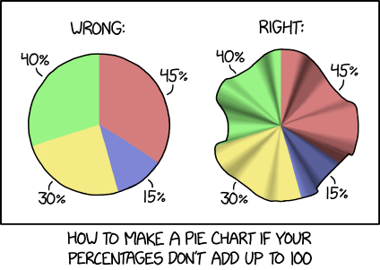
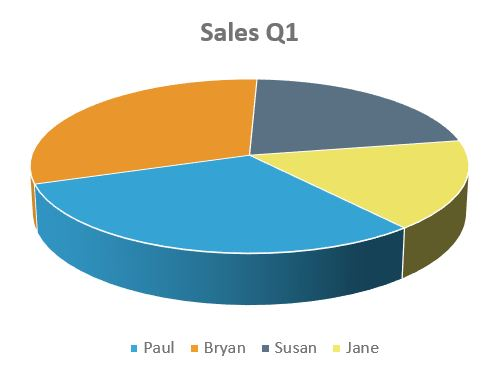
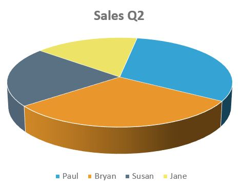

# bad_data_visualisation

This is a repository where I collect links to (highly selective!) articles/blogposts discussing good & bad data visualisation.

# The good

## Information visualisation principles

[The work of Edward Tufte and Graphics Press](https://www.edwardtufte.com/tufte/): The [data visualisation pioneer](https://medium.com/@storybydata/edward-tufte-data-visualization-pioneer-e70eb3a8e2f0) who coined the terms "chart-junk" and "data-ink ratio".

[Cleveland and McGill, Graphical Perception: Theory, Experimentation, and Application to the Development of Graphical Methods](./documents/2288400.pdf)

[39 studies about human perception in 30 minutes](https://medium.com/@kennelliott/39-studies-about-human-perception-in-30-minutes-4728f9e31a73): Lots of details and references (39 to be precise;-) discussing the human ability to extract information from different visualisations, e.g. in judging differences in arcs, areas, angles, bars etc.; the role of colour in visualisations

[Gelman and Unwin, Infovis and Statistical Graphics: Different Goals, Different Looks](https://medium.com/@storybydata/edward-tufte-data-visualization-pioneer-e70eb3a8e2f0): The trade-off between infographics/infovis and (statistical) data visualisation; there is also a [paywall blocked version](https://www.tandfonline.com/doi/abs/10.1080/10618600.2012.761141?journalCode=ucgs20)  

## Practical advice and examples

[Ten Simple Rules for Better Figures](https://journals.plos.org/ploscompbiol/article?id=10.1371/journal.pcbi.1003833): Key concepts include, "Know your audience", "Do not mislead the reader" and "Avoid chartjunk".

[What I Learned Recreating One Chart Using 24 Tools](https://source.opennews.org/articles/what-i-learned-recreating-one-chart-using-24-tools/): Interesting comparison of many popular data visualisation tools

[Martin Theus' Statistical Graphics and more](https://www.theusrus.de/blog/)

[Mistakes, we've drawn a few](https://medium.economist.com/mistakes-weve-drawn-a-few-8cdd8a42d368): "The Economist" takes a critical look on some of its own visualisations and shows how to fix/avoid mistakes

[Wagenmakers and Gronau, A Compendium of Clean Graphs in R](http://shinyapps.org/apps/RGraphCompendium/index.php)

## Beautiful visualisations

[Data is beautiful: 10 of the best data visualisation examples from history to today](https://www.tableau.com/learn/articles/best-beautiful-data-visualization-examples): Includes John Snow's cholera map

[Mathematical art with R](https://github.com/marcusvolz/mathart): harmonographs, Lissajous curves, Rose curves, Lorenz attractors, fractal ferns, and more

# The bad

[University of Melbourne: Statistical Consulting Centre: Why you shouldn't use pie charts](https://scc.ms.unimelb.edu.au/resources-list/data-visualisation-and-exploration/no_pie-charts)

[The issue with pie chart](data-to-viz.com/caveat/pie.html)

Pie charts are a bad idea. Yes. Always.

From Edward Tufte:

> The only worse design than a pie chart is several of them, for
then the viewer is asked to compare quantities located in spatial disarray
both within and between pies.

The only thing worse than pie charts are 3D pie charts (or worse still: blown-up 3D pie charts). Consider this:

Question: [Which employee had the most sales in Q1 and Q2?](http://www.getnerdyhr.com/3d-pie-charts-are-evil/)

# The ugly

[WTF Visualizations](https://viz.wtf/)

[Kaiser Fung's Junk charts](https://junkcharts.typepad.com/junk_charts/): Recycling chartjunk as junk art, or how to remake bad charts into good charts.

[The worst graphs of 2017](https://getdolphins.com/blog/the-worst-graphs-of-2017/)

[The worst graphs of 2018](https://getdolphins.com/blog/worst-graphs-of-2018/)

# Contact & disclaimer

This is a highly selective list of links & references pertaining to data visualisation. It is neither exhaustive, nor unbiased.

Feel free to [send me an email](mailto:maurits.evers@gmail.com) if you feel strongly about any information contained in this document.
